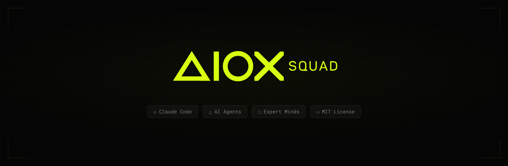

<p align="center">
  
</p>

<p align="center">
  <a href="#quickstart"><strong>Quickstart</strong></a> &middot;
  <a href="#squad-catalog"><strong>Catalog</strong></a> &middot;
  <a href="https://github.com/SynkraAI/aiox-squads"><strong>GitHub</strong></a> &middot;
  <a href="https://github.com/SynkraAI/aiox-squads/discussions"><strong>Discussions</strong></a>
</p>

<p align="center">
  <a href="https://github.com/SynkraAI/aiox-squads/blob/main/LICENSE"></a>
  <a href="https://github.com/SynkraAI/aiox-squads/stargazers"></a>
</p>

<p align="center">
  <a href="../README.md">🇧🇷 Versão em português</a>
</p>

<br/>

## What is AIOX Squads?

# The community repository for AIOX squads

**If an AI agent is an _employee_, a Squad is an entire _department_.**

This is the official community repository for sharing, discovering, and contributing squads for the [AIOX](https://github.com/SynkraAI/aiox-core) framework. Squads are self-contained packages of specialized AI agents — with Voice DNA, decision heuristics, and quality gates — that any AIOX user can install, use, and share.

**Find squads. Share squads. Build together.**

|        | Step                | Example                                                            |
| ------ | ------------------- | ------------------------------------------------------------------ |
| **01** | Browse the catalog  | _"I need elite copywriting."_                                       |
| **02** | Install it          | `*download-squad copy` — one command inside AIOX.                   |
| **03** | Activate the chief  | `@copy-chief` — the orchestrator routes your work to the right specialist. |
| **04** | Contribute back     | Built a squad? Open a PR and share it with the community.           |

<br/>

> **AIOX (the framework) lives at [aiox-core](https://github.com/SynkraAI/aiox-core).** This repository is where the community publishes and discovers squads — like npm is for Node.js packages.

<br/>

<div align="center">
<table>
  <tr>
    <td align="center"><strong>Works<br/>with</strong></td>
    <td align="center"><br/><sub>Claude Code</sub></td>
    <td align="center"><br/><sub>Codex CLI</sub></td>
    <td align="center"><br/><sub>Gemini CLI</sub></td>
    <td align="center"><br/><sub>Cursor</sub></td>
  </tr>
</table>

<em>Any IDE or CLI supported by <a href="https://github.com/SynkraAI/aiox-core">AIOX</a>.</em>

</div>

<br/>

## This repository is for you if

- ✅ You use **[AIOX](https://github.com/SynkraAI/aiox-core)** and want **ready-made squads** to install in your project
- ✅ You need **domain-specific knowledge** — copywriting, security, data, branding — not generic responses
- ✅ You want agents that **think like real experts**, with cloned frameworks and heuristics
- ✅ You **built a squad** and want to share it with the community
- ✅ You want to **learn** how squads are built and get inspired by existing examples
- ✅ You want to **compose multiple squads** — copy + brand + data — on the same project

<br/>

## What is a Squad?

A squad is a self-contained package of AI agents that work together in a domain. Not loose prompts — full systems:

<table>
<tr>
<td align="center" width="33%">
<h3>🧬 Expert Cloning</h3>
Agents carry Voice DNA and Thinking DNA from real specialists. Not generic prompts — real frameworks.
</td>
<td align="center" width="33%">
<h3>📦 Drop-in Ready</h3>
Install with <code>*download-squad</code> or copy the folder. Each squad is fully self-contained — agents, tasks, templates, data.
</td>
<td align="center" width="33%">
<h3>🏗️ Tier Architecture</h3>
Chief routes → Masters execute → Specialists assist → Support validates. Clear chain of command.
</td>
</tr>
<tr>
<td align="center">
<h3>✅ Quality Gates</h3>
Every squad is scored and validated. 4-tier quality system ensures agents actually deliver.
</td>
<td align="center">
<h3>🔀 Composable</h3>
Mix squads freely. Run copy + brand + data on the same project. They know how to hand off.
</td>
<td align="center">
<h3>🎯 Deterministic</h3>
Heuristics with IF/THEN rules and veto conditions. Agents follow proven playbooks, not vibes.
</td>
</tr>
</table>

<br/>

## Quickstart

### Prerequisite

Squads run on the [AIOX](https://github.com/SynkraAI/aiox-core) framework. If you don't have it yet:

```bash
npx aios-core init my-project
```

### Install a Squad from this repository

```bash
# Option 1: Via AIOX CLI (recommended)
@squad-chief
*download-squad copy

# Option 2: Manual
git clone https://github.com/SynkraAI/aiox-squads.git
cp -r aiox-squads/squads/copy ./squads/copy
```

### Use it

```bash
# Activate the squad's chief
@copy-chief

# See available commands
*help

# Run a task
*create-sales-page
```

> **Compatible with:** Claude Code, Codex CLI, Gemini CLI, Cursor — any IDE supported by [AIOX](https://github.com/SynkraAI/aiox-core).

<br/>

## Squad Catalog

Squads published by the community in this repository.

<!-- AUTO-GENERATED-SQUAD-CATALOG:START -->
| Squad | What it does | Source | Submitted by |
|-------|-----------|--------|-------------|
| [Apex](../squads/apex/) | Ultra-premium frontend squad for Web, Mobile, and Spatial platforms. | [PR #7](https://github.com/SynkraAI/aiox-squads/pull/7) | [@gamagab-code](https://github.com/gamagab-code) |
| [Brand](../squads/brand/) | Elite brand building squad powered by documented frameworks from the world's greatest branding minds. | [PR #8](https://github.com/SynkraAI/aiox-squads/pull/8) | [@pulsifyai-dev](https://github.com/pulsifyai-dev) |
| [Curator](../squads/curator/) | Squad especializado em curadoria de conteúdo existente. | [PR #1](https://github.com/SynkraAI/aiox-squads/pull/1) | [@diegodiniz1](https://github.com/diegodiniz1) |
| [Deep Research](../squads/deep-research/) | Squad de pesquisa profunda com pipeline 3-tier: Diagnostic (Tier 0), Execution (Tier 1), e Quality Assurance. | [PR #6](https://github.com/SynkraAI/aiox-squads/pull/6) | [@oalanicolas](https://github.com/oalanicolas) |
| [Dispatch](../squads/dispatch/) | Parallel execution engine for AIOS. | [PR #1](https://github.com/SynkraAI/aiox-squads/pull/1) | [@diegodiniz1](https://github.com/diegodiniz1) |
| [Education](../squads/education/) | Replicable system for transforming complex knowledge into mastery journeys using cognitive science + legal compliance | [PR #1](https://github.com/SynkraAI/aiox-squads/pull/1) | [@diegodiniz1](https://github.com/diegodiniz1) |
| [Kaizen](../squads/kaizen/) | O squad que vigia e melhora todos os outros. | [PR #4](https://github.com/SynkraAI/aiox-squads/pull/4) | [@Tiag8](https://github.com/Tiag8) |
| [Kaizen V2](../squads/kaizen-v2/) | Evolução do kaizen v1: sistema nervoso do projeto com sensoriamento diário (Tier 0). | [PR #10](https://github.com/SynkraAI/aiox-squads/pull/10) | [@murilloimparavel](https://github.com/murilloimparavel) |
| [Legal Analyst](../squads/legal-analyst/) | Sistema de analise juridica processual com 15 agentes especializados. | [PR #9](https://github.com/SynkraAI/aiox-squads/pull/9) | [@felippepestana](https://github.com/felippepestana) |
| [SEO](../squads/seo/) | Post-design SEO optimization squad. | [PR #3](https://github.com/SynkraAI/aiox-squads/pull/3) | [@rodrigofaerman](https://github.com/rodrigofaerman) |
| [Squad Creator](../squads/squad-creator/) | Base meta-squad para criar squads de agentes via templates e validacao estrutural. | [commit 3c90431](https://github.com/SynkraAI/aiox-squads/commit/3c90431a18fc2c42d8fadf1da2e596c390e9a850) | [@oalanicolas](https://github.com/oalanicolas) |
| [Squad Creator Pro](../squads/squad-creator-pro/) | **O upgrade pack que transforma o Squad Creator base em uma fábrica de squads de elite.** | [commit 921a002](https://github.com/SynkraAI/aiox-squads/commit/921a002c9c689ac131a8c4dc75de4a3f6f249c4e) | [@oalanicolas](https://github.com/oalanicolas) |
<!-- AUTO-GENERATED-SQUAD-CATALOG:END -->

> Have a squad ready? [Open a PR](#contributing) and share it with the community.

### Squad Creator: Free vs Pro

AIOX ships with the **Squad Creator Free** — 1 agent, 24 tasks, template-driven creation. For those who need more, there's the **Squad Creator Pro**: mind cloning, model routing, 3 specialist agents, and axioma assessment.

See the [full comparison](../squads/squad-creator-pro/).

<br/>

## How Squads Work

### The Tier System

Every squad follows a clear chain of command:

```
  Tier 0 — Chief (Orchestrator)
  ├── Receives mission, classifies intent, routes to the right specialist.
  │
  ├── Tier 1 — Masters
  │   Primary specialists. Execute the core domain missions.
  │
  ├── Tier 2 — Specialists
  │   Niche experts. Called by Tier 1 for specific sub-tasks.
  │
  └── Tier 3 — Support
      Shared utilities. Quality gates, templates, analytics.
```

### Agent Anatomy (6 Layers)

Every agent is a structured `.md` file with:

```yaml
agent:       # Identity — name, id, tier
persona:     # Role and communication style
voice_dna:   # Cloned vocabulary, sentence patterns, anti-patterns
heuristics:  # IF/THEN decision rules with veto conditions
examples:    # Concrete input/output pairs (min. 3)
handoffs:    # When to stop and delegate to another agent
```

### Maturity Levels

Squads in this repository go through validation and earn maturity badges:

| Level | Criteria | Badge |
|-------|----------|-------|
| **DRAFT** | Basic structure, score < 7.0 | 🔴 |
| **DEVELOPING** | Score ≥ 7.0, functional agents, executable tasks | 🟡 |
| **OPERATIONAL** | Score ≥ 9.0, tested in production, proven real-world usage | 🟢 |

<br/>

## Contributing

This is a community repository — **your contribution is what makes it grow**.

### Publish a Squad

1. Fork this repository
2. Create your squad following the [AIOX standard structure](https://github.com/SynkraAI/aiox-core)
3. Run `*validate-squad {name}` and ensure score ≥ 7.0
4. Open a PR with: domain description, validation score, and at least 1 real usage example

### Improve an Existing Squad

1. Open an issue describing the improvement
2. Fork and implement
3. Run `*validate-squad` to make sure nothing broke
4. Open a PR referencing the issue

### Create a Squad from Scratch

Use the squad-creator inside AIOX:

```
@squad-chief
*create-squad {domain}
```

Guided 6-phase workflow: Type Detection → Domain Elicitation → Template Loading → Architecture Proposal → Creation → Validation.

<br/>

## FAQ

**Is this AIOX?**
No. The AIOX framework lives at [aiox-core](https://github.com/SynkraAI/aiox-core). This repository is where the community shares squads — like npm is for Node.js packages.

**Do I need AIOX to use squads?**
Yes. Squads are packages that run on the [AIOX](https://github.com/SynkraAI/aiox-core) framework. Install with `npx aios-core init`.

**Do I need all the squads?**
No. Each squad is self-contained. Install only what you need.

**Does it only work on Claude Code?**
No. AIOX supports Claude Code, Codex CLI, Gemini CLI, and Cursor. Compatibility varies by IDE — Claude Code has full support.

**Can I use it in commercial projects?**
Yes. MIT license.

**How do I update a squad?**
Run `*download-squad {name}` again or replace the folder manually. Each squad's `CHANGELOG.md` documents breaking changes.

**How do I contribute a squad?**
Fork, create your squad, validate with `*validate-squad`, open a PR. See the [Contributing](#contributing) section.

**What's Voice DNA?**
It's how we clone expert communication style. Sentence starters, vocabulary rules, anti-patterns — so agents don't just know what to say, they know *how* to say it like the real expert would.

<br/>

## License

MIT &copy; 2026 AIOX Squads

<br/>

---

<p align="center">
  <sub>Open source under MIT. Community repository for <a href="https://github.com/SynkraAI/aiox-core">AIOX</a> squads.</sub>
</p>
